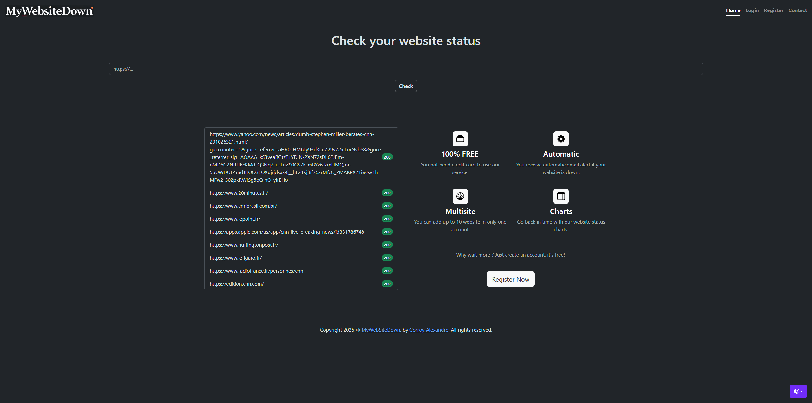

# MyWebSiteDown

Check your website status and send email alert if HTTP Status change on Symfony 7.1.*



## Getting Started

These instructions will get you a copy of the project up and running on your local machine for development and testing purposes.

### Prerequisites

What things you need to install the software and how to install them

```
PHP >8.2
MySQL >8.0 | MariaDB >11.2
```

### Installing

First :

```
Git clone https://github.com/alexandrecorroy/mywebsitedown.git
```

Update ".env.sample" with your parameters and rename ".env"

Install Dependencies :

```
composer install
```

Create DB :

```
php bin/console doctrine:database:create
```

Install DB :

```
php bin/console doctrine:schema:create
```

Consume Messenger with systemd (example for debian)

```
sudo nano /etc/systemd/system/messenger-consumer.service
```

Edit with this data :

```
[Unit]
Description=Messenger Consumer for scheduler_default
After=network.target

[Service]
User=www-data
Group=www-data
WorkingDirectory=/path/to/your/project
ExecStart=/usr/bin/php /path/to/your/project/bin/console messenger:consume scheduler_default --env=prod --no-interaction -vv
Restart=always

[Install]
WantedBy=multi-user.target
```

Configure your new service and lunch it to startup 

```
sudo systemctl daemon-reload
sudo systemctl start messenger-consumer
sudo systemctl enable messenger-consumer
```
 
### Installing with Docker

```
docker-compose up -d
```

### Fixtures 

Load Fixtures :

```
php bin/console doctrine:fixtures:load
```

Default user login : user@example.com / user

Default admin login : admin@example.com / admin

## Authors

* **Corroy Alexandre** - *Initial work* - [CORROYAlexandre](https://github.com/alexandrecorroy)

## License

This project is licensed under the MIT License - see the [LICENSE.md](LICENSE.md) file for details

## Website

[MyWebSiteDown.com](https://www.mywebsitedown.com/)
